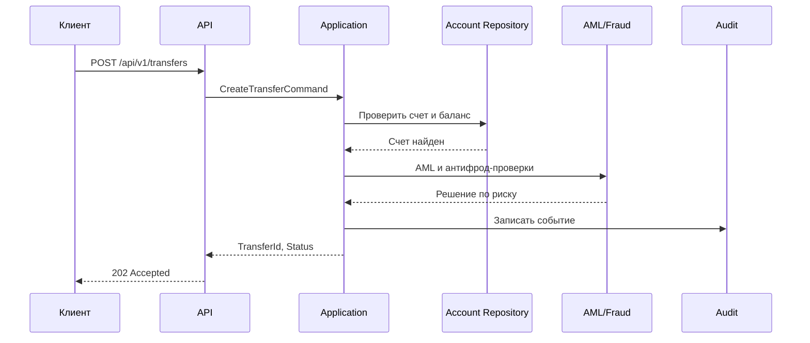

# Последовательность создания перевода

```mermaid
sequenceDiagram
    participant Client as Клиент
    participant Api as API
    participant App as Application
    participant Account as Account Repository
    participant Risk as AML/Fraud
    participant Audit as Audit

    Client->>Api: POST /api/v1/transfers
    Api->>App: CreateTransferCommand
    App->>Account: Проверить счет и баланс
    Account-->>App: Счет найден
    App->>Risk: AML и антифрод-проверки
    Risk-->>App: Решение по риску
    App->>Audit: Записать событие
    App-->>Api: TransferId, Status
    Api-->>Client: 202 Accepted
```
