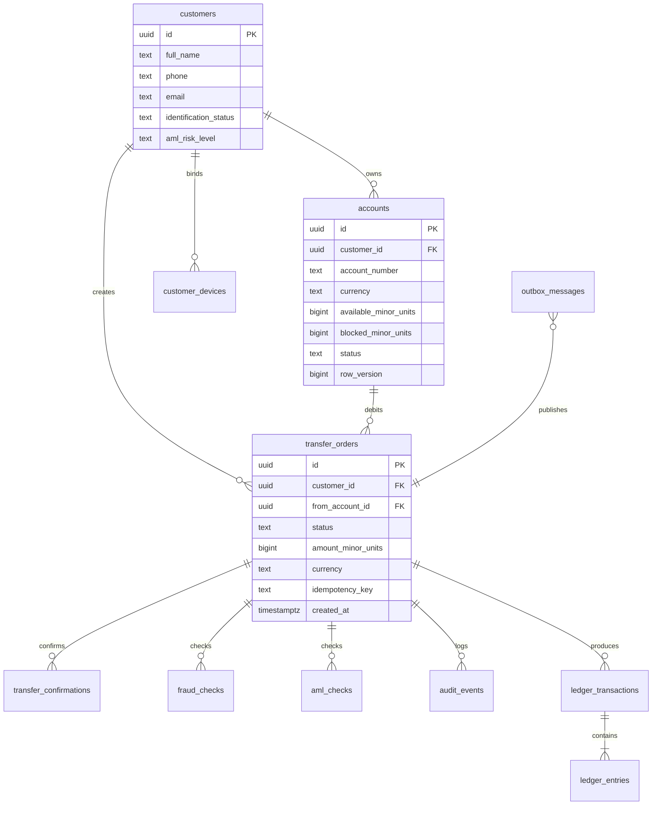

# ER-диаграмма базы данных

```mermaid
erDiagram
    customers ||--o{ accounts : owns
    customers ||--o{ customer_devices : binds
    customers ||--o{ transfer_orders : creates
    accounts ||--o{ transfer_orders : debits
    transfer_orders ||--o{ transfer_confirmations : confirms
    transfer_orders ||--o{ fraud_checks : checks
    transfer_orders ||--o{ aml_checks : checks
    transfer_orders ||--o{ audit_events : logs
    ledger_transactions ||--|{ ledger_entries : contains
    transfer_orders ||--o{ ledger_transactions : produces
    outbox_messages }o--|| transfer_orders : publishes

    customers {
        uuid id PK
        text full_name
        text phone
        text email
        text identification_status
        text aml_risk_level
    }

    accounts {
        uuid id PK
        uuid customer_id FK
        text account_number
        text currency
        bigint available_minor_units
        bigint blocked_minor_units
        text status
        bigint row_version
    }

    transfer_orders {
        uuid id PK
        uuid customer_id FK
        uuid from_account_id FK
        text status
        bigint amount_minor_units
        text currency
        text idempotency_key
        timestamptz created_at
    }
```
