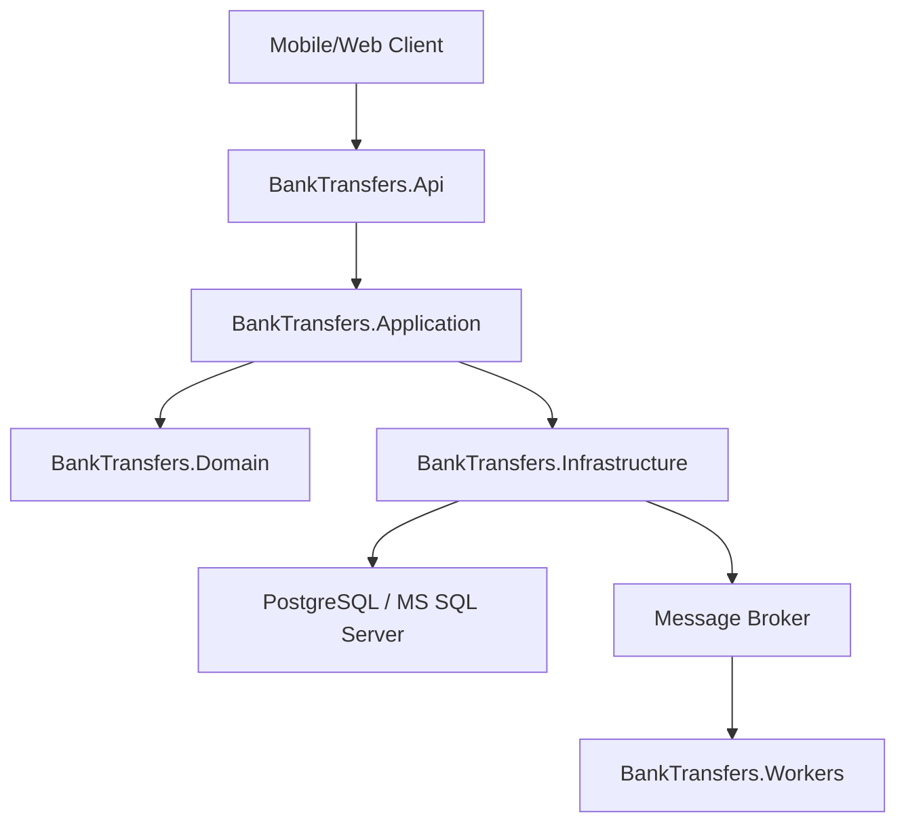

# Архитектура сервиса переводов

Проект построен как модульный монолит с разделением на слои Clean Architecture.

## Слои

`BankTransfers.Api` принимает HTTP-запросы, проверяет заголовки и вызывает сценарии приложения.

`BankTransfers.Application` содержит команды, обработчики, интерфейсы внешних зависимостей и бизнес-сценарии.

`BankTransfers.Domain` содержит сущности, value objects, статусы и правила переходов.

`BankTransfers.Infrastructure` содержит реализации репозиториев, AML, антифрода, криптографии и аудита.

`BankTransfers.Workers` предназначен для фоновой обработки outbox, уведомлений и сверок.
