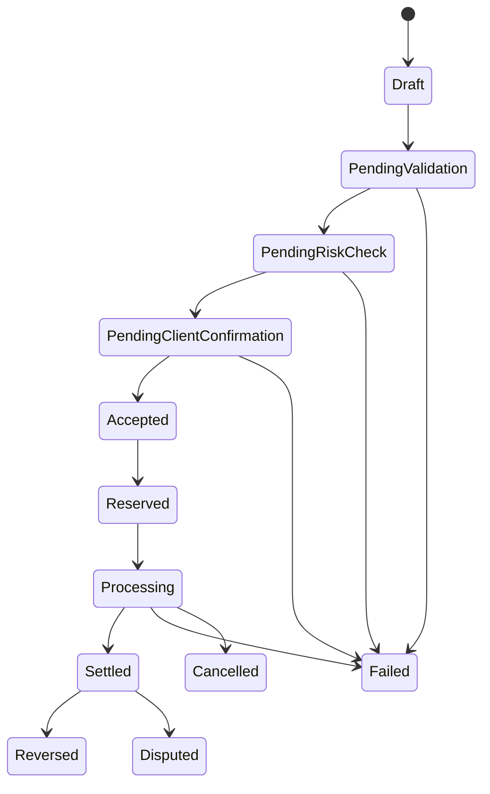

# Диаграмма состояний перевода

```mermaid
stateDiagram-v2
    [*] --> Draft
    Draft --> PendingValidation
    PendingValidation --> PendingRiskCheck
    PendingRiskCheck --> PendingClientConfirmation
    PendingClientConfirmation --> Accepted
    Accepted --> Reserved
    Reserved --> Processing
    Processing --> Settled
    PendingValidation --> Failed
    PendingRiskCheck --> Failed
    PendingClientConfirmation --> Failed
    Processing --> Failed
    Processing --> Cancelled
    Settled --> Reversed
    Settled --> Disputed
```
